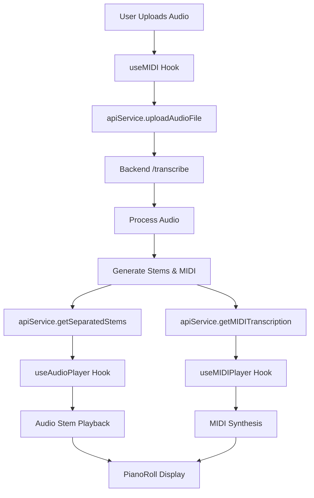

# 🎵 MIDICOM Frontend-Backend Integration

## 📋 Overview

This document describes the integration between the MIDICOM frontend (React + Electron) and backend (FastAPI) for real-time audio processing and MIDI transcription.

## 🔧 Backend API Endpoints

### Core Endpoints

| Endpoint | Method | Description | Parameters |
|----------|--------|-------------|------------|
| `/` | GET | API information | - |
| `/status` | GET | Server status | - |
| `/health` | GET | Health check | - |
| `/transcribe` | POST | Upload and process audio | `file`, `separation_model`, `transcription_method` |
| `/stems/{filename}` | GET | Get separated audio stems | `filename` |
| `/midi/{filename}` | GET | Get MIDI transcription | `filename` |
| `/download/{type}/{filename}` | GET | Download processed files | `type`, `filename` |

### Request/Response Examples

#### Upload Audio File
```bash
POST /transcribe
Content-Type: multipart/form-data

file: audio.wav
separation_model: htdemucs
transcription_method: librosa
```

Response:
```json
{
  "status": "success",
  "message": "File ricevuto e processato correttamente",
  "filename": "audio.wav",
  "size": 1024000,
  "separation_model": "htdemucs",
  "transcription_method": "librosa",
  "stems_file": "temp_stems/stems_audio.wav.json",
  "midi_file": "temp_midi/midi_audio.wav.json",
  "processing_time": 2.0
}
```

#### Get Stems
```bash
GET /stems/audio.wav
```

Response:
```json
{
  "status": "success",
  "filename": "audio.wav",
  "stems": {
    "drums": "temp_stems/drums_audio.wav",
    "bass": "temp_stems/bass_audio.wav",
    "other": "temp_stems/other_audio.wav",
    "vocals": "temp_stems/vocals_audio.wav"
  }
}
```

#### Get MIDI Data
```bash
GET /midi/audio.wav
```

Response:
```json
{
  "status": "success",
  "filename": "audio.wav",
  "midi_data": {
    "duration": 10.0,
    "tracks": [
      {
        "name": "Piano",
        "notes": [
          {"midi": 60, "time": 0, "duration": 1, "velocity": 80},
          {"midi": 64, "time": 1, "duration": 1, "velocity": 75}
        ]
      }
    ]
  }
}
```

## 🎛️ Frontend Integration

### Updated Hooks

#### `useMIDI.js`
- **New Parameters**: `(audioFile, selectedMidiFile)`
- **New Returns**: `stems`, `processingStep`, `processAudioFile`, `loadMIDIFile`
- **Features**:
  - Automatic audio file processing via backend
  - Real-time processing status updates
  - Fallback to mock data for test files
  - Error handling with user feedback

#### `useMIDIPlayer.js`
- **Enhanced**: Multi-track support with individual synthesizers
- **New Returns**: `trackVolumes`, `trackMutes`, `setTrackVolume`, `setTrackMute`
- **Features**:
  - Different synth types per track (sine, square, triangle)
  - Individual track volume and mute controls
  - Velocity scaling for realistic playback

#### `useAudioPlayer.js`
- **Enhanced**: Backend stem integration
- **New Returns**: `loading`, `error`, `stemVolumes`, `stemMutes`
- **Features**:
  - Automatic stem loading from backend URLs
  - Individual stem volume and mute controls
  - Error handling for failed stem loads

### New Services

#### `apiService.js`
Centralized API communication service with methods:
- `uploadAudioFile()` - Upload audio for processing
- `getSeparatedStems()` - Retrieve separated stems
- `getMIDITranscription()` - Get MIDI data
- `getBackendStatus()` - Check server status
- `isBackendAvailable()` - Connection test

#### `testBackendConnection.js`
Development utility for testing backend connectivity:
- `testBackendConnection()` - Test basic connectivity
- `testFileUpload()` - Test file upload functionality
- `runBackendTests()` - Run all tests

## 🚀 Usage Instructions

### 1. Start Backend Server
```bash
cd backend
python -m uvicorn app:app --reload --host 0.0.0.0 --port 8000
```

### 2. Start Frontend
```bash
cd frontend
npm run dev
```

### 3. Test Integration
1. Open browser console to see connection test results
2. Upload an audio file through the UI
3. Monitor processing steps in real-time
4. View separated stems and MIDI data in PianoRoll

## 🔄 Data Flow



## 🎯 Key Features

### Real-time Processing
- Live status updates during audio processing
- Progress indicators with descriptive messages
- Error handling with user-friendly messages

### Multi-track Support
- Individual synthesizers per MIDI track
- Track-specific volume and mute controls
- Different synth types for variety (drums, bass, piano)

### Stem Management
- Automatic loading of separated audio stems
- Individual stem volume and mute controls
- Support for multiple stem types (drums, bass, vocals, other)

### Fallback System
- Mock data for test files when backend unavailable
- Graceful degradation when endpoints not ready
- Development-friendly error messages

## 🛠️ Development Notes

### Backend Mock Implementation
The current backend implementation includes mock data generation for testing:
- Simulated processing time (2 seconds)
- Mock stems with placeholder file paths
- Mock MIDI data with sample notes

### Frontend Error Handling
- Network errors are caught and displayed to users
- Processing steps are shown in real-time
- Fallback to mock data ensures development continuity

### Performance Optimizations
- Memoized API calls with `useCallback`
- Debounced processing steps
- Efficient state management with separate hooks

## 🔮 Next Steps

1. **Real Audio Processing**: Replace mock data with actual Demucs separation
2. **Real MIDI Transcription**: Integrate librosa/CREPE for actual transcription
3. **File Management**: Implement proper file cleanup and storage
4. **Progress Tracking**: Add WebSocket support for real-time progress
5. **Error Recovery**: Implement retry mechanisms for failed operations

## 📝 Testing

Run backend tests:
```bash
# Test connection
curl http://localhost:8000/status

# Test health
curl http://localhost:8000/health

# Test upload (with file)
curl -X POST -F "file=@test.wav" http://localhost:8000/transcribe
```

Frontend tests are automatically run on app startup and logged to console.

## 📊 Logger System

MIDICOM implements a unified logging system across frontend and backend for consistent debugging and monitoring.

### Frontend Logger (`frontend/src/utils/logger.js`)

The frontend uses a development-only logging wrapper:

```javascript
import { devLog, devWarn, devError } from '../utils/logger'

// Only logs in development mode (import.meta.env.DEV)
devLog('Debug message:', data)
devWarn('Warning message')

// Always logs (for critical errors)
devError('Error message:', error)
```

**Features:**
- **Development Only**: Logs automatically disabled in production builds
- **Zero Overhead**: No performance impact in production
- **Consistent API**: Same interface as console.log/warn/error

### Backend Logger (`backend/logger.py`)

The backend uses a centralized colored logging system:

```python
from logger import setup_logger

logger = setup_logger(__name__)

logger.info("Information message")      # Green
logger.warning("Warning message")       # Yellow
logger.error("Error message")          # Red
logger.critical("Critical message")    # Bright Red + Bold
logger.debug("Debug message")          # Cyan
```

**Features:**
- **Colored Output**: ANSI colors for different log levels
- **Timestamps**: Automatic timestamp formatting
- **Module Names**: Shows which module logged the message
- **File Logging**: Optional file output support
- **Flexible Configuration**: Customizable log levels

### Log Levels

#### Frontend:
- `devLog()` - Development debugging (INFO level)
- `devWarn()` - Development warnings
- `devError()` - Always logged errors
- `prodLog()` - Production logging (use sparingly)

#### Backend:
- `DEBUG` - Detailed debugging information
- `INFO` - General informational messages (default)
- `WARNING` - Warning messages
- `ERROR` - Error messages
- `CRITICAL` - Critical error messages

### Best Practices

1. **Frontend**: Use `devLog` for debugging, preserve critical AudioContext/Transport logs
2. **Backend**: Use appropriate log levels (INFO for normal operations, ERROR for failures)
3. **Production**: Frontend logs automatically disabled, backend logs to stdout/file
4. **Debugging**: Check console (frontend) or terminal (backend) for colored output

